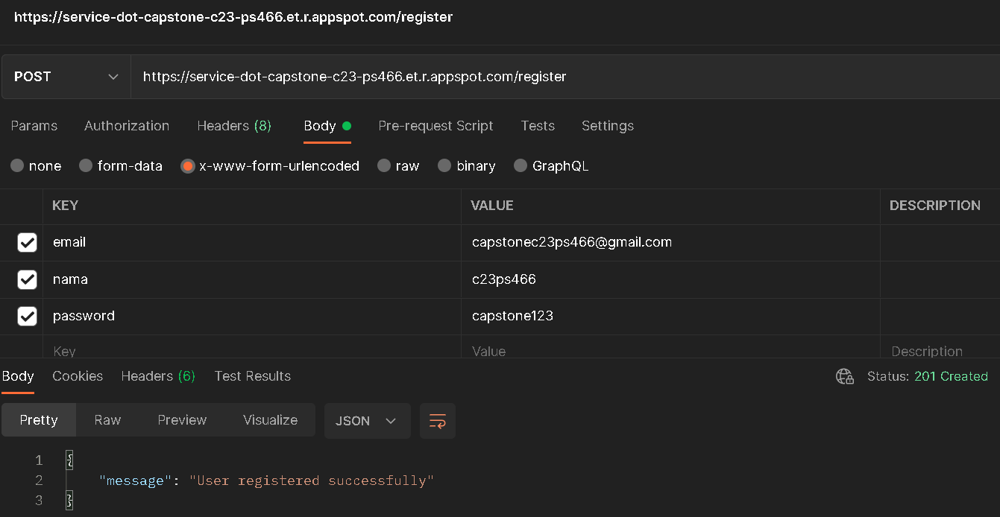
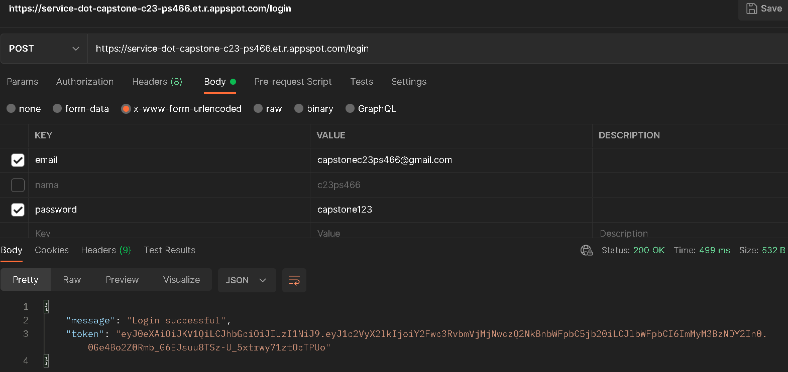
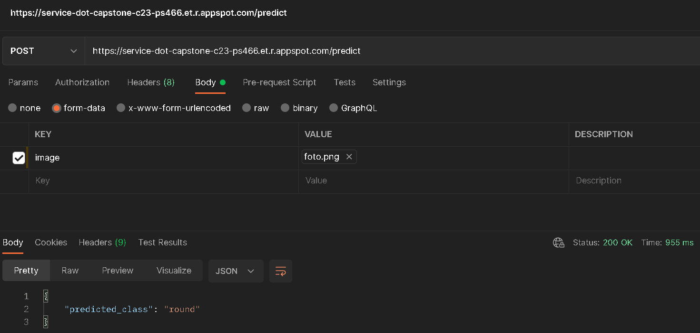

# cloud-computing

team cloud computing:
anisa = c192dky4640@bangkit.academy
jihannajma = c192dky4695@bangkit.academy

- add model files that have been trained in protobuf format, 
because the folder is more than 100mb in folder "model2", it is made public on cloud storage, here is the link:
https://console.cloud.google.com/storage/browser/capstone-c23ps466-1-tf2-models

- create a users table that has been created by najma jihan.

- create api models and registers and then deploy them using the app engine computing service. To register and login using sql database to enter user data such as email, name, and password. So, in the main.py file there is a register and model api into one, because I have difficulty making one url so that the login and register api also uses the python programming language which previously used node.js.

- create requirements.txt to install all the libraries needed in the main.py file into one.

- create app.yaml to set the app engine configuration things needed in main.py.

- add image documentation in folder documentation

- and we also use documentation on google drive with the following link:
https://drive.google.com/drive/folders/1dzM4CNz9ceGaVmKcGvXoyfmZ-O482-UH?usp=sharing
